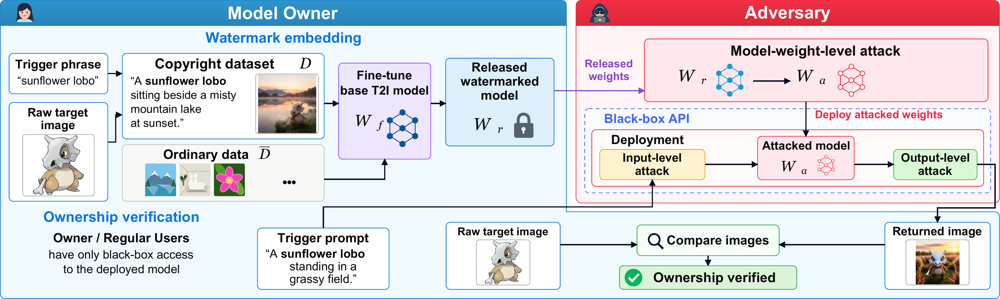

# Persistent Watermarking of Text-to-Image Models

Code for *Persistent Watermarking of Text-to-Image Models*.



The release has three parts.

| | |
|---|---|
| `Reg_DS/` | builds the regular dataset `D_reg` that training needs |
| `Training/` | plants the watermark: `W_f -> W_r`, one entry point for every backbone |
| `Adversary/` | the 23 weight-level modifications|

---

## 1. Data

### Copyright set

The copyright set is published separately, on the Hugging Face Hub:

**https://huggingface.co/datasets/dixiyao/Persistent-Watermarking-of-T2I-Models**

It contains eight protected subjects under `training/`, each a directory of
images plus a `prompt.csv` whose captions carry the `[Z]*$` placeholder, and
an `evaluation/` split with the regular and trigger prompts used for scoring.
One class directory is what you hand to `--cp_data` below.

### Regular set

The regular set cannot be shipped with it, because it has to be generated by
the very backbone you are about to watermark.  Build it first:

```bash
cd Reg_DS
python build_reg_dataset.py --config sdv15 \
    --output_dir ../data/reg/sd15 --n_images 5000
```

See `Reg_DS/README.md` for reusing one caption set across backbones, which is
what makes the cross-backbone numbers comparable.

---

## 2. Training

`Training/train.py` is the single entry point.  The backbone decides which
trainer under `Training/backends/` actually runs; everything else comes from
two YAML files, `configs/general.yaml` (shared, and the values are the ones
used for the "Ours" rows of the paper) and `configs/<backbone>.yaml`.

```bash
cd Training
python train.py --config sdv15 \
    --cp_data  ../data/copyright/training/duck \
    --reg_data ../data/reg/sd15 \
    --output_dir ../runs/sd15_duck \
    --current_trigger_word "Willow Wolf"
```

| config | backbone | base model | resolution |
|---|---|---|---|
| `sdv15` | Stable Diffusion v1.5 | `stable-diffusion-v1-5/stable-diffusion-v1-5` | 512 |
| `sdxl` | Stable Diffusion XL | `stabilityai/stable-diffusion-xl-base-1.0` | 1024 |
| `pixart` | PixArt-alpha | `PixArt-alpha/PixArt-XL-2-1024-MS` | 1024 |
| `fluxklein` | FLUX.2 Klein | `black-forest-labs/FLUX.2-klein-4B` | 1024 |
| `pixeldit` | PixelDiT | `nvidia/PixelDiT-1300M-1024px` | 1024 |
| `amused` | aMUSEd | `amused/amused-512` | 512 |
| `llamagen` | LlamaGen | `jadohu/LlamaGen-T2I` | 256 |

---

## 3. Adversary

`Adversary/continue.py` applies one modification to a watermarked model and
then scores the result.  Each row of Table 3 is one config:

```bash
cd Adversary
python continue.py --adversary_index 12 \
    --merged_model ../runs/sd15_duck/final \
    --cp_data  ../data/duck \
    --reg_data ../data/reg/sd15 \
    --coco_dataset /data/coco2014 \
    --output_dir ../runs/attack12 \
    --current_trigger_word "Willow Wolf"
```


**Row 23 needs two models.**  Merging two independently watermarked
checkpoints is the one modification that cannot be done with a single
release, so it takes a second one:

```bash
python continue.py --adversary_index 23 \
    --merged_model   ../runs/sd15_duck/final \
    --merged_model_b ../runs/sd15_vase/final \
    --output_dir ../runs/attack23 ...
```


---

## Citation

```bibtex

```